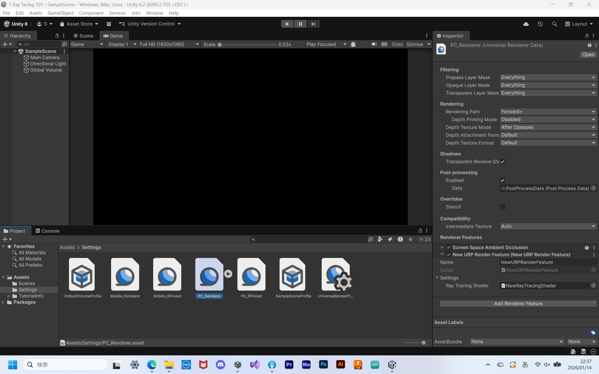

# レイトレーシング

## はじめに

プログラムワークショップⅣの管理用です。

解答はdevelopブランチを見てください。

## 結果画像

### レイトレーシング入門

上手く反映できませんでした。原因が見つけられなかったため、そのまま提出します。

### レイトレーシングでのシーンの描画

### レイトレーシングでの影

### あなたの考えた素敵なシェーダー

- 工夫した点
  - xxx
  - xxx
  - xxx

## 進め方

- 本リポジトリ (tpu-game-2025/PGWS4_14_raytracing)をforkしてください
- fork先のリポジトリを更新してください
- Unityのプロジェクトをsrc内で進めてください
- 結果を画面キャプチャして、画像としてリポジトリに追加して、上記のリンクから見られるようにしてください
- 完成したら本リポジトリのmainブランチにpull requestを投げてください

